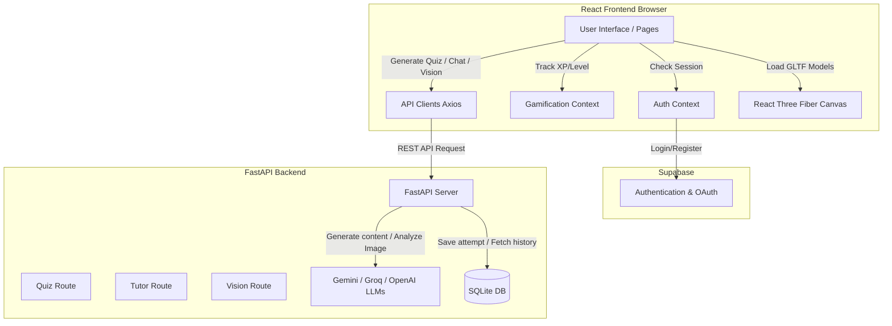

<div align="center">
  
  <h1>AR AnatomyAI 🧬</h1>
  <p><strong>A Next-Generation Interactive 3D Anatomy Learning Platform</strong></p>
  <p>
    <em>Powered by Artificial Intelligence, Computer Vision, and Augmented Reality mechanics.</em>
  </p>
</div>

<br />

## 📖 Overview

**AR AnatomyAI** is a state-of-the-art educational application designed specifically for medical students, healthcare professionals, biology educators, and anatomy enthusiasts. By bridging the gap between flat textbook diagrams and real-world clinical applications, it transforms the learning experience into an immersive, interactive, and personalized journey.

The platform fuses **high-fidelity 3D organ visualizations** with **generative AI tutors**, creating a dynamic environment where users can dissect, compare, and quiz themselves on human anatomy in real-time.

---

## 🚀 Core Features & Modules

### 1. 🫀 Interactive 3D & AR Organ Viewer
The core of the application is a high-performance 3D visualization engine.
- **11 Comprehensive Anatomical Systems**: Explore meticulously detailed models of the Heart, Brain, Lungs, Liver, Kidney, Stomach, Intestines, Skeleton, Skull, Eye, and the Full Human Anatomy.
- **Dynamic 3D Rendering Engine**: Built on `Three.js` and `@react-three/fiber`, featuring advanced lighting, anti-aliasing, and smooth 360-degree orbital controls.
- **Auto-Scaling & Centering Architecture**: An intelligent algorithmic bounding-box system automatically calculates the geometry of any 3D model. It seamlessly centers and scales models of vastly different sizes (e.g., an eyeball vs. a full human skeleton) for a unified, glitch-free viewing experience without manual coordinate adjustments.
- **Multimedia Integration**: Each organ features detailed clinical breakdowns, physiological explanations, and seamlessly integrated YouTube video guides for comprehensive learning.

### 2. 🔬 Side-by-Side Pathology Comparison
Move beyond healthy models by studying real-world medical conditions.
- **Multi-Dimensional Analysis**: Compare Male vs. Female, Healthy vs. Diseased, and Adult vs. Child anatomical models side-by-side in real-time.
- **Spatial Disease Markers (Highlights)**: The 3D engine allows users to identify specific diseased regions (e.g., cirrhosis nodes in the liver, tumors, or arterial blockages) via interactive 3D spatial highlight spheres.
- **Clinical Data Overlays**: View comparative statistics such as organ weight, volume, and metabolic clearance rates synchronized directly with the 3D viewport.

### 3. 📸 AI-Powered Organ Recognition (Vision AI)
Leverage the power of computer vision to identify unknown medical images.
- **Image Upload & Capture Pipeline**: Upload or snap photos of medical diagrams, MRI scans, X-rays, or anatomy charts.
- **Instant AI Analysis**: Powered by Google's Gemini Vision AI, the platform instantly identifies the organ, breaks down its physiological structures, and flags potential visual anomalies or pathological markers.
- **Markdown-Rendered Reports**: Results are formatted in clean, readable Markdown and integrated directly into the dashboard for easy study note creation.

### 4. 🤖 Intelligent Conversational Anatomy Tutor
Don't just look at models—talk to them.
- **Conversational LLM Integration**: Engage with a virtual tutor powered by Gemini and Groq LLMs for ultra-fast, accurate, and conversational medical explanations.
- **Context-Aware Assistance**: The tutor understands which organ you are currently studying and tailors its hints, definitions, and anatomical analogies accordingly.
- **Speech-to-Text Integration**: Hands-free studying enabled by OpenAI's whisper APIs, allowing users to ask complex physiological questions verbally while manipulating the 3D models.

### 5. 🎯 Adaptive Gamified Quiz System
Test your knowledge with an AI that adapts to your learning curve.
- **Dynamic Quiz Generation**: Quizzes are never hardcoded. The AI dynamically generates unique multiple-choice questions based on your chosen organ and difficulty level (Easy, Medium, Hard, Expert).
- **Gamification Mechanics**: Earn XP (Experience Points), track daily study streaks, unlock milestones, and collect mastery badges to stay motivated.
- **Real-time Evaluative Feedback**: Detailed, AI-generated explanations are provided for every incorrect answer, ensuring continuous learning and concept correction.

### 6. 📈 Learning Analytics Dashboard
A central hub for tracking your educational journey.
- **Visual Progress Tracking**: Beautiful, interactive charts built with `Recharts` display mastery over time, daily study streaks, and historical quiz accuracy.
- **Strengths & Weaknesses Profiler**: The system aggregates your quiz data across all 11 anatomical systems to identify areas needing improvement and recommends targeted study sessions (e.g., "Review Renal Functions").
- **Premium Glassmorphism UI**: A visually stunning, modern interface featuring frosted glass effects, animated gradients, and custom 3D PNG icons that mimic Windows 11 Fluent Design.

### 7. 🔐 Secure Authentication & Session Management
- **Supabase BaaS Integration**: Rock-solid backend authentication supporting Email/Password and Google OAuth sign-ins.
- **Strict Route Guarding**: React Router DOM protection ensures sensitive learning data and premium AI features are kept strictly private.
- **Persistent Sessions**: "Remember Me" functionality securely syncs your session state, instantly redirecting returning users past the login screens for frictionless access.

---

## 🏗️ Technical Architecture & Stack

AR AnatomyAI utilizes a decoupled architecture, separating a blazing-fast React frontend from a robust Python FastAPI backend dedicated to heavy AI/LLM processing and state management.

### Frontend (Client-Side)
- **Framework**: React 18 + Vite (Lightning-fast HMR)
- **3D Engine**: Three.js, `@react-three/fiber`, `@react-three/drei`
- **Routing**: React Router DOM (v6)
- **Styling**: TailwindCSS, Vanilla CSS (Custom Glassmorphism design system)
- **Data Visualization**: Recharts (for analytics dashboard)
- **Icons**: React-Icons, Custom 3D Fluent PNGs

### Backend (Server-Side)
- **Framework**: Python FastAPI
- **Database**: SQLite (managed via SQLAlchemy ORM for relational integrity)
- **AI Integrations**: 
  - `google-generativeai` (Gemini Pro & Gemini Vision Pro)
  - `groq` (High-speed LPU inference for instant chat responses)
  - `openai` (Whisper Speech-to-Text)
- **Server**: Uvicorn (ASGI web server)

### Backend-as-a-Service (BaaS)
- **Authentication**: Supabase Auth

---

## 🔄 Data Flow Diagram



---

## 🛠️ Detailed Setup & Installation Guide

### Prerequisite: Supabase Setup
1. Log in to [Supabase](https://supabase.com) and create a new project.
2. Go to **Project Settings -> API** and copy your `Project URL` and `anon public` key.
3. Open `backend/.env` (create it if it doesn't exist) and add:
   ```env
   VITE_SUPABASE_URL=your_project_url
   VITE_SUPABASE_ANON_KEY=your_anon_key
   ```
4. Navigate to **Authentication -> Providers** in Supabase:
   - Enable **Email** provider (disable "Confirm email" for local dev).
   - Enable **Google** provider with OAuth credentials from Google Cloud Console.

### Part 1: Python FastAPI Backend
1. Navigate to the backend directory:
   ```bash
   cd backend/quiz
   ```
2. Create and activate a virtual environment:
   ```bash
   # Windows
   python -m venv .venv
   .venv\Scripts\activate

   # Linux/macOS
   python3 -m venv .venv
   source .venv/bin/activate
   ```
3. Install dependencies:
   ```bash
   pip install -r requirements.txt
   ```
4. Configure Backend Environment Variables in `backend/quiz/.env`:
   ```env
   GEMINI_API_KEY=your_gemini_key
   GROQ_API_KEY=your_groq_key
   OPENAI_API_KEY=your_openai_key
   ```
5. Initialize the database schema:
   ```bash
   python -m app.init_db
   ```
6. Start the server:
   ```bash
   uvicorn app.main:app --reload
   # The backend API will start on http://127.0.0.1:8000
   ```

### Part 2: React Frontend
1. Open a new terminal in the project root (`ARAnatomyAI/`).
2. Install Node dependencies:
   ```bash
   npm install
   ```
3. Start the Vite development server:
   ```bash
   npm run dev
   # The React application will start on http://localhost:5173
   ```

---

## 📂 Comprehensive Directory Structure

```text
ARAnatomyAI/
├── backend/                  
│   ├── quiz/                 # Python FastAPI Microservice
│   │   ├── app/
│   │   │   ├── routes/       # Endpoint controllers (quiz.py, progress.py, tutor.py, vision.py)
│   │   │   ├── services/     # AI Provider integrations (Gemini, Groq, OpenAI APIs)
│   │   │   ├── database.py   # SQLAlchemy configuration and SQLite connections
│   │   │   ├── init_db.py    # DB migration and initialization script
│   │   │   ├── models.py     # SQLAlchemy Schema definitions (User attempts, Scores)
│   │   │   └── main.py       # FastAPI application factory and CORS setup
│   │   ├── .env              # Backend secrets (DO NOT COMMIT)
│   │   └── requirements.txt  # Python package list
│   ├── .env                  # Frontend Vite environment variables (Supabase)
│   └── .env.example          # Template for required .env variables
├── public/                   
│   ├── icons/                # Custom 3D PNG Icons (Liver, Heart, Brain, etc.)
│   └── models/               # High-fidelity GLTF/GLB 3D Anatomical Models
├── src/                      
│   ├── assets/               # CSS, Logos, and static images
│   ├── components/           # Reusable UI (Navbar, Route Guards, Buttons, Modals)
│   ├── contexts/             # Global React State (AuthContext, GamificationContext)
│   ├── data/                 # Static configs (comparisonData.js, videoData.js)
│   ├── models/               # R3F Canvas components and Model Loaders (GLTFLoader logic)
│   ├── pages/                
│   │   ├── ARViewer/         # 3D exploration and video integration page
│   │   ├── Comparison/       # Side-by-side pathology viewing logic
│   │   ├── Dashboard/        # Analytics, Timeline, and Gamification stats
│   │   ├── Quiz/             # AI Quiz Generator, Evaluation, and Results Modals
│   │   └── OrganSelection/   # Main entry hub for selecting anatomical systems
│   ├── services/             # Axios API clients and Supabase auth wrappers
│   ├── App.jsx               # React Router configuration
│   └── index.css             # Base CSS, Glassmorphism, and Tailwind utility classes
├── eslint.config.js          # ESLint rules
├── vite.config.js            # Vite configuration and server proxy mapping
└── package.json              # Node dependencies & NPM scripts
```

---

## 🌐 API Documentation Overview

The FastAPI backend exposes several RESTful endpoints to power the frontend:

- `POST /api/quiz/generate`: Generates a dynamic 5-question quiz based on `organ_name` and `difficulty`.
- `POST /api/progress/attempt`: Saves a completed quiz score to the SQLite database.
- `GET /api/progress/history`: Retrieves the user's historical quiz data for the Dashboard charts.
- `POST /api/tutor/chat`: Sends a conversational query to the Groq/Gemini LLM for anatomy tutoring.
- `POST /api/vision/analyze`: Accepts a multipart form image upload (X-ray/diagram) and returns a Gemini Vision AI analysis.

---

## 🛡️ Security & Environment Best Practices
- **Never commit `.env` files**: All sensitive API keys (Gemini, Supabase, OpenAI, Groq) must remain strictly local. Ensure `.env` is in your `.gitignore`.
- **Route Protection**: The React application enforces strict route guarding via `ProtectedRoute.jsx`. 
- **Database Safety**: API calls mapping to user progress require valid user IDs authenticated via Supabase to prevent data cross-contamination.

---

## 🤝 Contributing Guidelines
Contributions to AR AnatomyAI are highly encouraged! To contribute:
1. Fork the repository.
2. Create a feature branch (`git checkout -b feature/AmazingFeature`).
3. Commit your changes (`git commit -m 'Add some AmazingFeature'`).
4. Push to the branch (`git push origin feature/AmazingFeature`).
5. Open a Pull Request with a detailed summary of your architectural changes.

**Quality Checks**: Ensure you run `npm run lint` for frontend changes and verify the Python backend endpoints using Swagger UI (`http://127.0.0.1:8000/docs`) before submitting a PR.

---
*Built with ❤️ for the future of medical education.*
