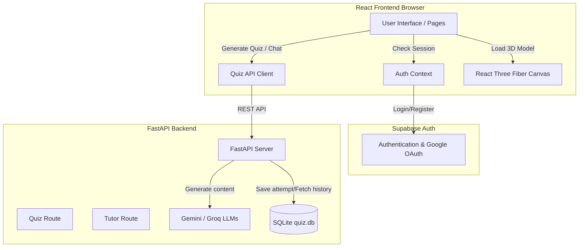

# AR AnatomyAI

AR AnatomyAI is a state-of-the-art interactive learning platform designed to help students study human anatomy. It blends detailed 3D/AR organ visualizations with an AI-powered anatomy tutor and a dynamic quiz generator. 

The application utilizes a secure, Supabase-backed authentication system featuring Email/Password sign-ins, Google OAuth, and automatic "Remember Me" session persistence.

---

## Key Features

1. **Interactive 3D/AR Organ Viewer**:
   - Inspect anatomical models of human organs in real-time.
   - Powered by Three.js and `@react-three/fiber` for smooth, interactive 3D rendering.
2. **AI Anatomy Tutor**:
   - A conversational AI tutor powered by Gemini/Groq LLMs.
   - Provides hints, explanations, and definitions of complex terms.
   - Includes speech-to-text voice capabilities for hands-free queries.
3. **Dynamic Quiz Generator**:
   - Generates customized quizzes dynamically based on the selected organ and difficulty level.
   - Evaluates performance and highlights weak areas.
4. **Learning Progress & Analytics**:
   - Visual progress tracking dashboard showing average scores, attempt counts, and weak points using interactive charts (via Recharts).
5. **Secure Authentication & Guarded Routing**:
   - Full authentication flow powered by Supabase.
   - Seamless session recovery (Remember Me) that redirects authenticated users past login pages directly to the learning dashboard.

---

## Project Structure

```text
ARAnatomyAI/
├── backend/                  # Backend & Env Configuration
│   ├── quiz/                 # Python FastAPI Quiz & Tutor Service
│   │   ├── app/
│   │   │   ├── routes/       # API endpoints (quiz, progress, tutor, voice)
│   │   │   ├── services/     # Third-party integrations (gemini, openai, voice, database)
│   │   │   ├── database.py   # SQLite database connection setup
│   │   │   ├── init_db.py    # Database tables initializer
│   │   │   └── main.py       # FastAPI application entry point
│   │   ├── .env              # Backend API keys (Gemini, Groq, OpenAI)
│   │   └── requirements.txt  # Python requirements
│   ├── .env                  # Frontend env variables (Vite Supabase config)
│   └── .env.example          # Frontend env configuration template
├── public/                   # Static assets (3D GLTF models, region maps)
├── src/                      # React Frontend Source
│   ├── assets/               # CSS & global image assets
│   ├── components/           # Core layout components (Navbar, Route Guards)
│   ├── contexts/             # Global React contexts (AuthContext)
│   ├── models/               # 3D canvas loader components
│   ├── pages/                # Individual page views (Dashboard, AITutor, Quiz, etc.)
│   ├── services/             # API client services (supabase.js, quizApi.js)
│   ├── App.jsx               # Navigation and React Router setup
│   ├── main.jsx              # React app entry point
│   └── index.css             # Base CSS and Tailwind styles
├── vite.config.js            # Vite config (maps envDir to ./backend)
├── package.json              # Node dependencies & scripts
└── README.md                 # Project documentation
```

---

## Environment Configuration

Environment variables are separated between the frontend client configuration and the Python backend services:

### 1. Frontend Environment Variables
* **Path**: `backend/.env` (Vite is configured to load environment variables from the `backend/` directory using the `envDir` setting).
* **Variables**:
  * `VITE_SUPABASE_URL`: The URL of your Supabase project (from API Settings).
  * `VITE_SUPABASE_ANON_KEY`: The Anonymous public API key for your Supabase project.
  * `VITE_QUIZ_API_BASE_URL`: Base URL of the Python backend (optional, defaults to `http://127.0.0.1:8000`).

### 2. Backend Environment Variables
* **Path**: `backend/quiz/.env`
* **Variables**:
  * `GEMINI_API_KEY`: API Key for Google Gemini (used for generating quizzes and tutor explanations).
  * `GROQ_API_KEY`: API Key for Groq (used as a high-speed alternative for quizzes and tutor responses).
  * `OPENAI_API_KEY`: API Key for OpenAI (used for speech-to-text voice transcription capabilities).

---

## Step-by-Step Installation & Setup

### Prerequisite 1: Supabase Authentication Setup
1. Log in to the [Supabase Dashboard](https://supabase.com) and create a new project.
2. Go to **Project Settings -> API** and copy your `Project URL` and `anon public` key.
3. Place these into `backend/.env` under `VITE_SUPABASE_URL` and `VITE_SUPABASE_ANON_KEY`.
4. Navigate to **Authentication -> Providers**:
   - Enable the **Email** provider. (Optional: toggle off "Confirm email" for instant local testing).
   - Enable the **Google** provider. Create an OAuth credential in the [Google Cloud Console](https://console.cloud.google.com) and add the Client ID and Client Secret in Supabase.

---

### Setup Part 2: Backend (FastAPI Quiz Service)
1. Open a terminal and navigate to the quiz directory:
   ```bash
   cd backend/quiz
   ```
2. Create a virtual environment:
   ```bash
   python -m venv .venv
   ```
3. Activate the virtual environment:
   - **Linux/macOS**:
     ```bash
     source .venv/bin/activate
     ```
   - **Windows**:
     ```bash
     .venv\Scripts\activate
     ```
4. Install python dependencies:
   ```bash
   pip install -r requirements.txt
   ```
5. Set up your API Keys inside `backend/quiz/.env` (duplicate the example file if needed).
6. Initialize the SQLite database:
   ```bash
   python -m app.init_db
   ```
7. Run the FastAPI development server:
   ```bash
   uvicorn app.main:app --reload
   ```
   The backend API will run on `http://127.0.0.1:8000`.

---

### Setup Part 3: Frontend (React + Vite)
1. Open a new terminal in the project root directory.
2. Install npm dependencies:
   ```bash
   npm install
   ```
3. Launch the development server:
   ```bash
   npm run dev
   ```
4. Open the application in your browser at `http://localhost:5173`.

---

## Architecture & Data Flow



* **Authentication Guarding**: `ProtectedRoute.jsx` intercepts routes for users who aren't logged in. `PublicRoute.jsx` automatically redirects authenticated users past the authentication views (`/login`, `/register`) straight to the `/dashboard`.
* **State Syncing**: The user's active session is fetched and kept in sync on the client-side using Supabase's realtime `onAuthStateChange` hook, removing dependencies on legacy client-side local storage.
