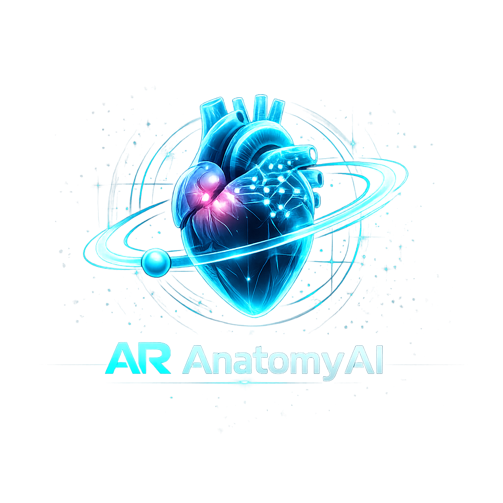

<div align="center">
  
  <h1>AR AnatomyAI 🧬</h1>
  <p><strong>An Interactive 3D Anatomy Learning Platform Powered by Artificial Intelligence</strong></p>
  <p><em>Explore • Compare • Quiz • Learn — All in Your Browser</em></p>

  <br />

  
  
  
  
  
  
</div>

<br />

---

## 📖 Overview

**AR AnatomyAI** is a full-stack, AI-powered educational platform that transforms how students study human anatomy. Instead of flat textbook diagrams, students interact with **11 photorealistic 3D organ models** directly in their browser. Instead of static question banks, an **AI quiz engine** generates unique questions every session. Instead of memorizing terminology alone, students **converse with an AI anatomy tutor** that adapts to their organ of study and answers in real-time.

The platform integrates **four distinct AI systems** into one cohesive experience:

| AI System | Provider | What It Does |
|---|---|---|
| **Text Generation** | Google Gemini Pro | Dynamic quiz generation, anatomy tutoring |
| **Vision Analysis** | Google Gemini Vision | Medical image recognition (X-rays, MRIs, diagrams) |
| **Fast Inference** | Groq (LLaMA 3 70B) | Sub-2-second tutor chat responses |
| **Speech Recognition** | OpenAI Whisper | Hands-free voice queries to the AI tutor |

Authentication is handled securely via **Supabase** (Email/Password + Google OAuth), and all quiz progress is persisted in a **SQLite** database managed by **SQLAlchemy ORM**.

---

## 🚀 Features

### 🫀 1. Interactive 3D Organ Viewer
- **11 Anatomical Models**: Heart, Brain, Lungs, Liver, Kidney, Stomach, Intestines, Skeleton, Skull, Eye, Full Human Anatomy
- **Real-Time WebGL Rendering**: Powered by `Three.js` + `@react-three/fiber` + `@react-three/drei`
- **Auto-Scaling Algorithm**: Custom bounding box normalization (`THREE.Box3`) automatically centers and scales every model — from a tiny eyeball to a full skeleton — to fit perfectly in the viewport without manual adjustments
- **Three-Point Lighting**: Ambient + Directional + Point lighting rig simulates clinical overhead illumination for realistic tissue shading
- **OrbitControls**: 360° rotation, zoom, pan with smooth damped momentum
- **Educational Panels**: Each organ displays clinical notes, anatomical landmarks, physiological functions, and curated YouTube video guides

### 🔬 2. Side-by-Side Pathology Comparison
- **Three Comparison Modes**: Male vs. Female, Healthy vs. Diseased, Adult vs. Child
- **Dual 3D Canvases**: Two independent React Three Fiber viewports render simultaneously
- **3D Disease Markers**: Translucent sphere meshes highlight pathological regions (cirrhosis, tumors) at calculated bounding box offset positions
- **Clinical Statistics Overlay**: Quantitative data panels showing weight, volume, metabolic rates beneath each viewport

### 📸 3. AI Organ Recognition (Vision AI)
- **Image Upload**: Drag-and-drop or click-to-browse — supports X-rays, CT scans, MRIs, textbook diagrams
- **Gemini Vision Pro Analysis**: Image is base64-encoded and submitted to Gemini Vision with a structured medical prompt
- **Structured Reports**: AI returns organ identification, visible structures, pathological indicators, and clinical context as formatted Markdown

### 🤖 4. AI Anatomy Tutor
- **Multi-Turn Conversations**: Full chat history is maintained and sent with each request for contextual continuity
- **Dual-Provider Routing**: Routes to Groq first (ultra-fast LPU inference, ~1.3s response) with Gemini Pro as fallback
- **Context-Aware**: Automatically receives the currently selected organ as conversation context
- **Voice Input**: Microphone audio → Web Speech API → OpenAI Whisper transcription → auto-fills chat input

### 🎯 5. Dynamic Gamified Quiz System
- **AI-Generated Questions**: Every quiz is unique — Gemini/Groq generates 5 MCQs in strict JSON schema per session
- **Four Difficulty Levels**: Easy, Medium, Hard, Expert — each testing progressively deeper clinical knowledge
- **Gamification Engine**: XP points, daily study streaks, mastery badges (e.g., "Heart Expert" at 90%+ cardiac quiz score)
- **Detailed Explanations**: AI-written rationale for each correct answer, enabling learning from mistakes

### 📈 6. Learning Analytics Dashboard
- **Per-Organ Mastery**: Tracks latest quiz scores across all 11 anatomical systems
- **Recharts Visualizations**: LineChart (accuracy over time), PieChart (strengths vs. weaknesses), progress bars
- **Study Streak Counter**: Consecutive calendar days with at least one quiz attempt
- **Recent Activity Feed**: Timeline of quiz attempts with scores and timestamps
- **Glassmorphism UI**: Premium frosted-glass card design with animated gradient accents

### 🔐 7. Secure Authentication
- **Supabase Auth**: Email/Password registration + Google OAuth 2.0 sign-in
- **Route Protection**: `ProtectedRoute.jsx` redirects unauthenticated users; `PublicRoute.jsx` redirects authenticated users away from login
- **Persistent Sessions**: Supabase `onAuthStateChange` hook maintains reactive session state — no localStorage polling

### 🎨 8. Splash Screen & Premium UI
- **Animated Splash**: Branded loading screen with logo animation on initial app load
- **Custom 3D Icons**: Hand-crafted Fluent-style 3D PNG icons for Liver, Kidney, Stomach, Intestines, and Human Anatomy
- **Dark Glassmorphism Theme**: `backdrop-filter: blur()` frosted glass effects, subtle gradients, micro-animations throughout
- **Responsive Design**: Adapts to different viewport sizes

---

## 🏗️ Architecture

### System Architecture Diagram

```
┌──────────────────────────────────────────────────────────────┐
│                  FRONTEND  (React 19 + Vite 8)               │
│                                                              │
│  ┌─────────────┐  ┌─────────────┐  ┌──────────────────────┐ │
│  │ AuthContext  │  │ Gamification│  │ API Clients (Axios)  │ │
│  │ (Supabase)  │  │ Context     │  │                      │ │
│  └─────────────┘  └─────────────┘  └──────────────────────┘ │
│                                                              │
│  ┌─────────────┐  ┌─────────────┐  ┌──────────────────────┐ │
│  │ 3D Viewer   │  │ Comparison  │  │ Quiz + Dashboard +   │ │
│  │ (R3F Canvas)│  │ (2× Canvas) │  │ Tutor + Vision       │ │
│  └─────────────┘  └─────────────┘  └──────────────────────┘ │
└───────────────────────────┬──────────────────────────────────┘
                            │ REST API (HTTP/JSON + multipart)
┌───────────────────────────▼──────────────────────────────────┐
│                  BACKEND  (Python FastAPI)                    │
│                                                              │
│  ┌──────────┐  ┌──────────┐  ┌──────────┐  ┌─────────────┐ │
│  │ /quiz/*  │  │ /tutor/* │  │ /vision/*│  │ /voice/*    │ │
│  └────┬─────┘  └────┬─────┘  └────┬─────┘  └──────┬──────┘ │
│       │              │             │               │         │
│  ┌────▼──────────────▼─────────────▼───────────────▼──────┐ │
│  │              AI Services Layer                         │ │
│  │  gemini_service │ openai_service │ voice_service       │ │
│  │  (Gemini Pro)   │ (Groq+Whisper) │ (Whisper STT)      │ │
│  └────────────────────────────────────────────────────────┘ │
│  ┌────────────────────────────────────────────────────────┐ │
│  │              SQLite Database (SQLAlchemy)              │ │
│  └────────────────────────────────────────────────────────┘ │
└──────────────────────────────────────────────────────────────┘
```

### Data Flow

```
User Interaction
    │
    ├── [Auth Required?] → ProtectedRoute → Supabase session check
    │
    ├── [Explore 3D] → useGLTF loader → Box3 auto-scale → OrbitControls → WebGL
    │
    ├── [Start Quiz] → POST /quiz/generate → Gemini/Groq → JSON MCQs
    │                  → POST /progress/attempt → SQLite save
    │
    ├── [Ask Tutor] → POST /tutor/chat → Groq (fast) | Gemini (fallback)
    │
    ├── [Voice Query] → MediaRecorder → POST /voice/transcribe → Whisper → text
    │
    └── [Upload Image] → POST /vision/analyze → Base64 → Gemini Vision → Markdown
```

---

## 📂 Project Structure

```
AR_AnatomyAI/
│
├── backend/
│   ├── .env                              # Frontend env vars (Supabase keys)
│   ├── .env.example                      # Template
│   └── quiz/                             # Python FastAPI microservice
│       ├── app/
│       │   ├── main.py                   # FastAPI app factory + CORS
│       │   ├── database.py               # SQLAlchemy engine + session
│       │   ├── init_db.py                # DB table initialization
│       │   ├── routes/
│       │   │   ├── quiz.py               # /quiz/generate endpoint
│       │   │   ├── progress.py           # /progress/attempt + /progress/history
│       │   │   ├── tutor.py              # /tutor/chat endpoint
│       │   │   ├── vision.py             # /vision/analyze (image upload)
│       │   │   └── voice.py              # /voice/transcribe (audio upload)
│       │   └── services/
│       │       ├── gemini_service.py      # Gemini Pro + Vision + Quiz generation
│       │       ├── openai_service.py      # Groq chat + OpenAI Whisper
│       │       ├── voice_service.py       # Audio transcription wrapper
│       │       └── knowledge_service.py   # Knowledge base utilities
│       ├── .env                          # Backend secrets (API keys)
│       └── requirements.txt
│
├── public/
│   ├── icons/                            # Custom 3D PNG organ icons
│   │   ├── liver.png, kidney.png, stomach.png, intestines.png, human.png
│   └── models/                           # GLTF/GLB 3D anatomical models
│       ├── human_heart.glb               # 74.8 MB — High-detail heart
│       ├── human_brain_cerebrum__brainstem.glb
│       ├── respiratory_system.glb        # Lungs
│       ├── kidney.glb                    # 53.3 MB — Detailed kidney
│       ├── realistic_human_stomach.glb
│       ├── small_and_large_intestine.glb
│       ├── human_male_skull.glb
│       ├── Brain.glb
│       ├── male_full_body_ecorche.glb    # Full human anatomy
│       └── ecorche_-_anatomy_study.glb   # Skeleton/muscle study
│
├── src/
│   ├── assets/
│   │   ├── logo.png                      # Application logo
│   │   └── hero.png                      # Hero section image
│   ├── components/
│   │   ├── Navbar.jsx                    # Navigation with auth state
│   │   ├── ProtectedRoute.jsx            # Auth guard — redirects to /login
│   │   └── PublicRoute.jsx               # Prevents re-auth — redirects to /dashboard
│   ├── contexts/
│   │   ├── AuthContext.jsx               # Supabase session provider
│   │   └── GamificationContext.jsx       # XP, streaks, badges provider
│   ├── data/
│   │   ├── comparisonData.js             # Organ comparison configs (models, stats, icons)
│   │   └── videoData.js                  # Curated YouTube video IDs per organ
│   ├── pages/
│   │   ├── Splash/                       # Animated splash loading screen
│   │   ├── Login/                        # Email + Google OAuth login
│   │   ├── Register/                     # Account registration
│   │   ├── Dashboard/                    # Analytics hub + activity timeline
│   │   ├── OrganSelection/              # 11-organ selection grid
│   │   ├── ARViewer/                     # 3D organ exploration + educational content
│   │   ├── Comparison/                   # Side-by-side pathology viewer
│   │   ├── Quiz/                         # AI quiz generator + evaluation
│   │   │   ├── QuizHome.jsx             # Organ + difficulty selector
│   │   │   └── components/DifficultyModal.jsx
│   │   ├── LearningProgress/            # Full analytics dashboard (Recharts)
│   │   ├── AITutor/                      # Conversational AI + voice input
│   │   ├── OrganRecognition/            # Vision AI image upload + analysis
│   │   ├── BodySelection/               # Body region selector
│   │   └── Settings/                     # User preferences
│   ├── services/
│   │   ├── supabase.js                   # Supabase client singleton
│   │   └── quizApi.js                    # Axios wrappers for all backend APIs
│   ├── App.jsx                           # React Router configuration
│   ├── main.jsx                          # React DOM mount point
│   └── index.css                         # Global CSS + glassmorphism design system
│
├── .env                                  # Root environment config
├── .gitignore
├── eslint.config.js
├── vite.config.js                        # Vite config (envDir: './backend')
├── package.json
└── README.md
```

---

## 🛠️ Tech Stack

### Frontend

| Package | Version | Purpose |
|---|---|---|
| `react` | 19.2.6 | Core UI framework |
| `react-dom` | 19.2.6 | DOM rendering |
| `react-router-dom` | 7.15.1 | Client-side routing + route guards |
| `three` | 0.184.0 | WebGL 3D rendering engine |
| `@react-three/fiber` | 9.6.1 | React renderer for Three.js |
| `@react-three/drei` | 10.7.7 | OrbitControls, useGLTF, helpers |
| `@supabase/supabase-js` | 2.107.0 | Supabase Auth client |
| `axios` | 1.16.1 | HTTP client for backend API calls |
| `recharts` | 3.8.1 | Data visualization (Line, Pie, Bar charts) |
| `framer-motion` | 12.40.0 | Animations and transitions |
| `react-icons` | 5.6.0 | SVG icon library (Feather, Font Awesome) |
| `jspdf` + `jspdf-autotable` | 4.2.1 | PDF report generation |
| `tailwindcss` | 4.3.0 | Utility-first CSS framework |
| `vite` | 8.0.12 | Build tool + dev server with HMR |

### Backend

| Package | Purpose |
|---|---|
| `fastapi` | Async Python web framework |
| `uvicorn` | ASGI server for FastAPI |
| `google-genai` | Gemini Pro + Vision API access |
| `openai` | Whisper speech-to-text + Groq integration |
| `python-multipart` | Multipart form data (image/audio uploads) |
| `python-dotenv` | Environment variable management |
| `psycopg2-binary` | PostgreSQL adapter (production-ready) |
| `requests` | HTTP utilities |
| `cryptography` | Security utilities |

### External Services

| Service | Provider | Role |
|---|---|---|
| Gemini Pro | Google AI | Quiz generation, anatomy tutoring |
| Gemini Vision Pro | Google AI | Medical image organ recognition |
| Groq (LLaMA 3 70B) | Groq Cloud | Ultra-fast tutor chat (~1.3s latency) |
| OpenAI Whisper | OpenAI | Speech-to-text transcription |
| Supabase Auth | Supabase | Email/Password + Google OAuth |
| YouTube Embed | Google | Educational anatomy video guides |

---

## ⚙️ Installation & Setup

### Prerequisites
- **Node.js** 18+ and **npm**
- **Python** 3.10+
- A **Supabase** project (free tier works)
- API keys for **Google Gemini**, **Groq**, and **OpenAI**

### Step 1: Clone the Repository
```bash
git clone https://github.com/Shaik-Nihal/Anatomy_AI.git
cd Anatomy_AI
```

### Step 2: Supabase Setup
1. Create a project at [supabase.com](https://supabase.com)
2. Go to **Settings → API** — copy your Project URL and anon key
3. Go to **Authentication → Providers** — enable Email and Google OAuth
4. Create `backend/.env`:
```env
VITE_SUPABASE_URL=https://your-project.supabase.co
VITE_SUPABASE_ANON_KEY=eyJhbGciOi...
VITE_QUIZ_API_BASE_URL=http://127.0.0.1:8000
```

### Step 3: Backend Setup
```bash
cd backend/quiz
python -m venv .venv

# Windows
.venv\Scripts\activate

# macOS/Linux
source .venv/bin/activate

pip install -r requirements.txt
```

Create `backend/quiz/.env`:
```env
GEMINI_API_KEY=your_gemini_key
GROQ_API_KEY=your_groq_key
OPENAI_API_KEY=your_openai_key
```

Initialize database and start the server:
```bash
python -m app.init_db
uvicorn app.main:app --reload
# Backend running at http://127.0.0.1:8000
# Swagger docs at http://127.0.0.1:8000/docs
```

### Step 4: Frontend Setup
```bash
# From project root
npm install
npm run dev
# Frontend running at http://localhost:5173
```

---

## 🔌 API Endpoints

| Endpoint | Method | Request | Response | Description |
|---|---|---|---|---|
| `/quiz/generate` | POST | `{ organ, difficulty }` | `{ questions: [...] }` | AI generates 5 unique MCQs |
| `/progress/attempt` | POST | `{ user_id, organ, score, total, percentage }` | `{ success: true }` | Save quiz result |
| `/progress/history` | GET | `?user_id=<uuid>` | `[{ organ, score, ... }]` | Fetch all past attempts |
| `/tutor/chat` | POST | `{ message, organ }` | `{ response: "..." }` | AI tutor conversation |
| `/voice/transcribe` | POST | `multipart: audio` | `{ text: "..." }` | Whisper speech-to-text |
| `/vision/analyze` | POST | `multipart: image` | `{ analysis: "..." }` | Gemini Vision image analysis |

---

## 🧠 Technical Highlights

### Auto-Scaling 3D Models
Every organ model comes from a different source with different scales. Our bounding box algorithm solves this:

```javascript
const box = new THREE.Box3().setFromObject(scene);
const center = box.getCenter(new THREE.Vector3());
const size = box.getSize(new THREE.Vector3());
const maxDim = Math.max(size.x, size.y, size.z);
const scale = TARGET_SIZE / maxDim;
scene.scale.setScalar(scale);
scene.position.sub(center.multiplyScalar(scale));
```

This means a 0.02-unit eyeball and a 2.5-unit skeleton both render perfectly in the same viewport.

### Multi-Provider AI Routing
```
User Query
    │
    ├── [Chat/Tutor] → Try Groq first (1.3s avg) → Gemini fallback
    ├── [Quiz Gen]   → Gemini Pro (strong multi-step reasoning)
    ├── [Vision]     → Gemini Vision Pro (image understanding)
    └── [Voice]      → OpenAI Whisper (speech-to-text)
```

### Robust JSON Quiz Extraction
LLMs sometimes wrap JSON in markdown fences or add explanatory text. Our extraction pipeline handles all cases:
1. Direct `JSON.parse()` attempt
2. Regex extraction from ` ```json ... ``` ` fences
3. Raw `[...]` array extraction
4. Graceful error with user-facing message

### Responsive Design & Tailwind CSS Migration
The entire platform features a **mobile-first responsive design** powered by **Tailwind CSS**. 
- **Adaptive Layouts**: Complex 3D viewports and comparative charts automatically collapse from side-by-side grids on desktops to stacked layouts on mobile devices.
- **Glassmorphism UI**: High-performance backdrop blurs and semi-transparent layers scale seamlessly across all screen sizes.
- **Unified Styling**: CSS modules combined with `@apply` Tailwind directives ensure consistent design tokens (spacing, typography, colors) and fluid animations.

---

## 📊 3D Model Library

| Organ | File | Size | Source Format |
|---|---|---|---|
| Heart | `human_heart.glb` | 74.8 MB | GLB (binary GLTF) |
| Brain | `human_brain_cerebrum__brainstem.glb` | 12.2 MB | GLB |
| Lungs | `respiratory_system.glb` | 17.4 MB | GLB |
| Kidney | `kidney.glb` | 53.3 MB | GLB |
| Stomach | `realistic_human_stomach.glb` | 22.7 MB | GLB |
| Intestines | `small_and_large_intestine.glb` | 15.6 MB | GLB |
| Skull | `human_male_skull.glb` | 3.6 MB | GLB |
| Skeleton | `ecorche_-_anatomy_study.glb` | 16.3 MB | GLB |
| Full Body | `male_full_body_ecorche.glb` | 30.0 MB | GLB |
| Brain (alt) | `Brain.glb` | 3.8 MB | GLB |
| Heart (alt) | `Heart1.glb` | 74.8 MB | GLB |

---

## 🔒 Environment Variables Reference

### Frontend (`backend/.env`)
```env
VITE_SUPABASE_URL=         # Supabase project URL
VITE_SUPABASE_ANON_KEY=    # Supabase anon public key
VITE_QUIZ_API_BASE_URL=    # Backend URL (default: http://127.0.0.1:8000)
```

### Backend (`backend/quiz/.env`)
```env
GEMINI_API_KEY=            # Google AI Studio key (Gemini Pro + Vision)
GROQ_API_KEY=              # Groq Cloud key (LLaMA 3 / Mixtral)
OPENAI_API_KEY=            # OpenAI key (Whisper speech-to-text)
```

> ⚠️ **Never commit `.env` files.** All are listed in `.gitignore`.

---

## 🛡️ Security
- **Route Guards**: `ProtectedRoute.jsx` wraps all authenticated pages — unauthenticated access is impossible
- **Session Sync**: Supabase's `onAuthStateChange` maintains reactive session state
- **API Isolation**: All AI API keys live exclusively on the backend — never exposed to the browser
- **CORS Configuration**: FastAPI CORS middleware restricts origins in production

---

## 👥 Team

| Name | Role |
|---|---|
| **Shaik Nihal** | Developer |
| **P Jaajitha Reddy** | Developer |
| **S Durga Sri** | Developer |
| **I Kiran Kumar** | Developer |
| **L Monika** | Developer |

---

## 📄 License

This project was developed during an internship at **Career Direction**.

---

<div align="center">
  <p><em>Built with ❤️ for the future of medical education</em></p>
</div>
